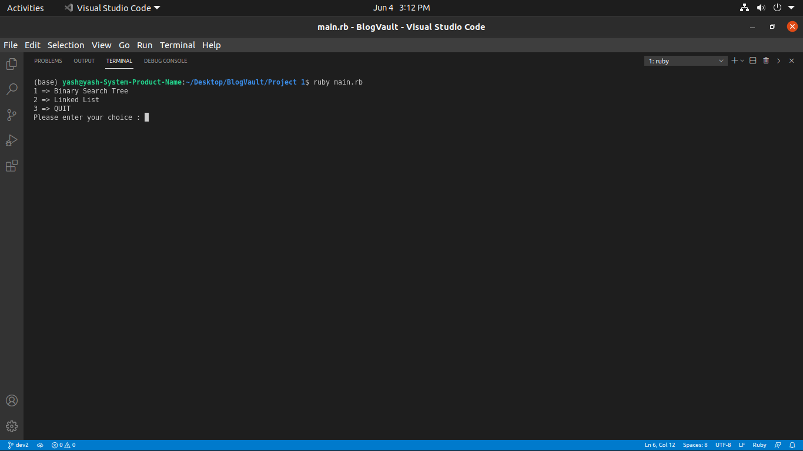
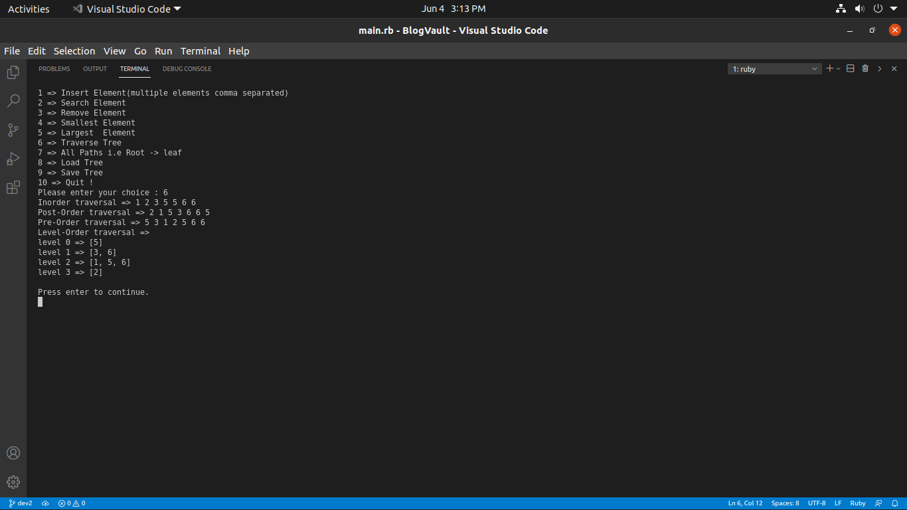
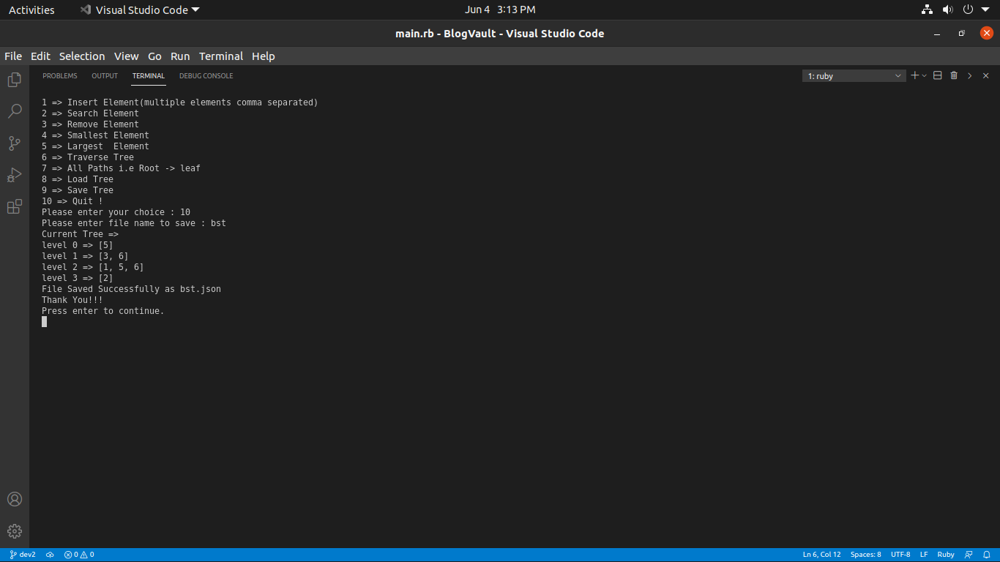
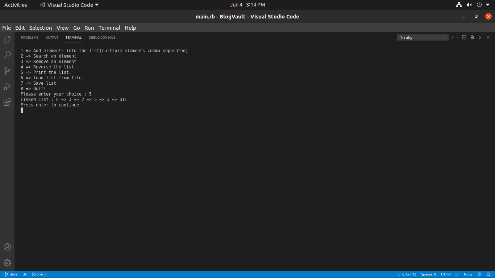

# This Project consist Binary Search Tree and Linked List Data Structure, implement in ruby

### Steps to run project :

1) Clone this repository

2) Run `ruby ./DataStructureProject/main.rb`

### Outputs :

 

